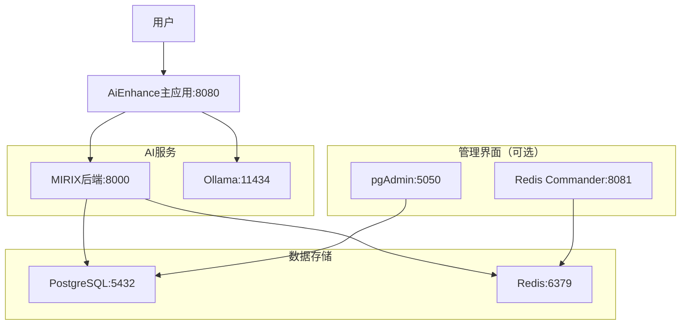

# AiEnhance Docker部署指南

## 📋 概述

这份指南将帮助您使用Docker Compose一键部署完整的AiEnhance记忆-认知协同系统，包括：

- **AiEnhance主应用** - 记忆-认知协同系统核心
- **MIRIX后端** - 多智能体记忆系统服务
- **PostgreSQL** - 记忆存储数据库（带pgvector扩展）
- **Redis** - 缓存和会话存储
- **Ollama** - 本地LLM服务
- **管理界面** - pgAdmin和Redis Commander（可选）

## 🛠️ 系统要求

### 硬件要求
- **CPU**: 4核心以上（推荐8核心）
- **内存**: 8GB以上（推荐16GB）
- **存储**: 20GB可用空间（用于模型和数据）
- **GPU**: 可选，支持NVIDIA GPU加速

### 软件要求
- **Docker**: 20.10+
- **Docker Compose**: 2.0+
- **Ollama**: 最新版本（本地运行）
- **操作系统**: Linux、macOS、Windows（带WSL2）

### Ollama 安装和配置

```bash
# macOS 安装
brew install ollama

# Linux 安装
curl -fsSL https://ollama.ai/install.sh | sh

# Windows 安装
# 下载 https://ollama.ai/download/windows

# 启动 Ollama 服务
ollama serve

# 安装推荐模型
ollama pull qwen3:8b    # 中文大语言模型
ollama pull bge-m3        # 多语言嵌入模型
```

## 🚀 快速开始

### 1. 克隆仓库
```bash
git clone <your-repo-url>
cd AiEnhance
```

### 2. 配置环境
```bash
# 复制环境配置文件
cp .env.example .env

# 编辑配置（可选）
nano .env
```

### 3. 一键启动
```bash
# 使用快速启动脚本（推荐）
./docker-start.sh

# 或者手动启动
docker-compose up -d
```

### 4. 验证部署
```bash
# 运行集成测试
python test_docker_integration.py

# 或者手动检查
curl http://localhost:8080/health
```

## 🔧 详细配置

### 环境变量说明

| 变量名 | 默认值 | 说明 |
|--------|--------|------|
| `POSTGRES_DB` | `mirix_memory` | PostgreSQL数据库名 |
| `POSTGRES_USER` | `mirix` | 数据库用户名 |
| `POSTGRES_PASSWORD` | `mirix_password` | 数据库密码 |
| `DEFAULT_LLM_PROVIDER` | `ollama` | 默认LLM提供商 |
| `DEFAULT_LLM_MODEL` | `qwen3:8b` | 默认LLM模型 |
| `OPENAI_API_KEY` | - | OpenAI API密钥（可选） |
| `ANTHROPIC_API_KEY` | - | Anthropic API密钥（可选） |

### 服务端口

| 服务 | 端口 | 访问地址 |
|------|------|----------|
| AiEnhance主应用 | 8080 | http://localhost:8080 |
| API文档 | 8080 | http://localhost:8080/docs |
| MIRIX后端 | 8000 | http://localhost:8000 |
| Ollama | 11434 | http://localhost:11434 |
| PostgreSQL | 5432 | localhost:5432 |
| Redis | 6379 | localhost:6379 |
| pgAdmin | 5050 | http://localhost:5050 |
| Redis Commander | 8081 | http://localhost:8081 |

### 启动选项

```bash
# 基本启动
./docker-start.sh

# 跳过模型下载（如果已有模型）
./docker-start.sh --no-models

# 包含管理界面
./docker-start.sh --with-management

# 查看帮助
./docker-start.sh --help
```

## 📊 服务架构



## 🧪 测试功能

### 健康检查
```bash
# 检查所有服务状态
curl http://localhost:8080/health

# 检查MIRIX状态  
curl http://localhost:8000/health

# 检查Ollama状态
curl http://localhost:11434/api/tags
```

### API测试
```bash
# 发送查询请求
curl -X POST "http://localhost:8080/api/query" \
     -H "Content-Type: application/json" \
     -d '{"query": "什么是人工智能？", "user_id": "test_user"}'

# 获取系统状态
curl http://localhost:8080/api/system/status

# 查看API文档
open http://localhost:8080/docs
```

### 记忆系统测试
```bash
# 运行完整集成测试
python test_docker_integration.py

# 运行系统架构测试
python test_system_architecture.py
```

## 🔧 常见问题

### Q: 容器启动失败
**A**: 检查端口占用和Docker资源限制
```bash
# 检查端口占用
netstat -tulpn | grep :8080

# 查看Docker日志
docker-compose logs aienhance

# 重启服务
docker-compose restart
```

### Q: Ollama模型下载缓慢
**A**: 可以预先下载模型或使用代理
```bash
# 手动下载模型
docker exec aienhance-ollama ollama pull qwen3:8b

# 或跳过自动下载
./docker-start.sh --no-models
```

### Q: 内存不足
**A**: 调整模型大小或增加系统内存
```bash
# 使用更小的模型
export DEFAULT_LLM_MODEL="qwen3:8b"

# 或减少服务数量（在docker-compose.yml中注释不需要的服务）
```

### Q: GPU加速不工作
**A**: 确保安装了NVIDIA Docker支持
```bash
# 安装nvidia-docker
distribution=$(. /etc/os-release;echo $ID$VERSION_ID)
curl -s -L https://nvidia.github.io/nvidia-docker/gpgkey | sudo apt-key add -
curl -s -L https://nvidia.github.io/nvidia-docker/$distribution/nvidia-docker.list | sudo tee /etc/apt/sources.list.d/nvidia-docker.list

sudo apt-get update && sudo apt-get install -y nvidia-docker2
sudo systemctl restart docker
```

## 📈 性能优化

### 1. 数据库优化
```sql
-- 在PostgreSQL中调整配置
ALTER SYSTEM SET shared_buffers = '256MB';
ALTER SYSTEM SET effective_cache_size = '1GB';
ALTER SYSTEM SET random_page_cost = 1.1;
```

### 2. Redis优化
```bash
# 在docker-compose.yml中添加
redis:
  command: redis-server --maxmemory 512mb --maxmemory-policy allkeys-lru
```

### 3. Ollama优化
```bash
# 设置环境变量
export OLLAMA_NUM_PARALLEL=2
export OLLAMA_MAX_LOADED_MODELS=2
```

## 📋 维护指南

### 数据备份
```bash
# 备份PostgreSQL数据
docker exec aienhance-postgres pg_dump -U mirix mirix_memory > backup.sql

# 备份Redis数据
docker exec aienhance-redis redis-cli BGSAVE
```

### 日志查看
```bash
# 查看所有服务日志
docker-compose logs -f

# 查看特定服务日志
docker-compose logs -f aienhance
docker-compose logs -f mirix-backend
```

### 更新部署
```bash
# 拉取最新代码
git pull

# 重新构建并启动
docker-compose build --no-cache
docker-compose up -d
```

### 清理数据
```bash
# 停止所有服务
docker-compose down

# 删除所有数据（谨慎使用）
docker-compose down -v

# 清理未使用的镜像
docker system prune -f
```

## 🛡️ 安全考虑

### 1. 网络安全
- 生产环境中修改默认密码
- 使用防火墙限制端口访问
- 启用HTTPS（使用反向代理）

### 2. 数据安全
- 定期备份重要数据
- 配置数据加密
- 限制数据库访问权限

### 3. API安全
```bash
# 在.env中配置API密钥
MIRIX_API_KEY=your_secure_api_key
OPENAI_API_KEY=your_openai_key
```

## 📚 相关文档

- [系统架构文档](ARCHITECTURE.md)
- [API参考文档](http://localhost:8080/docs)
- [LLM集成指南](LLM_INTEGRATION_SUMMARY.md)
- [开发指南](DEVELOPMENT.md)

## 🆘 获取帮助

如果遇到问题：

1. 查看 [常见问题](#常见问题) 部分
2. 运行诊断脚本：`python test_docker_integration.py`
3. 查看服务日志：`docker-compose logs`
4. 提交Issue到项目仓库

---

🎉 **恭喜！** 您已成功部署AiEnhance记忆-认知协同系统！

现在您可以：
- 访问 http://localhost:8080 使用系统
- 查看 http://localhost:8080/docs 了解API
- 运行测试脚本验证功能