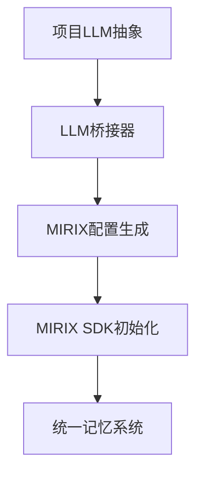

# MIRIX 统一LLM集成指南

本指南介绍如何实现MIRIX与项目大模型抽象层的非侵入式集成。

## 🎯 集成目标

实现**最优方案**：让MIRIX使用项目统一的大模型抽象，而不是独立的大模型配置。

### 优势对比

| 特性 | 独立模式 | 统一模式 (本方案) |
|------|----------|-------------------|
| **大模型管理** | 分离的 | 统一的 ✅ |
| **配置复杂度** | 高 | 低 ✅ |
| **兼容性** | 受限 | 全面 ✅ |
| **维护成本** | 高 | 低 ✅ |
| **侵入性** | 高 | 零 ✅ |

## 🏗️ 架构设计

### 核心组件

1. **MirixLLMBridge**: LLM配置桥接器
2. **MirixUnifiedAdapter**: 统一记忆适配器
3. **EnhancedSystemFactory**: 增强系统工厂

### 集成流程



## 🚀 使用方法

### 方式一：便捷工厂函数

```python
import aienhance

# Ollama + MIRIX统一系统
system = aienhance.create_ollama_mirix_system(
    model_name="qwen3:8b",
    ollama_base="http://localhost:11434",
    system_type="educational"
)

# OpenAI + MIRIX统一系统  
system = aienhance.create_openai_mirix_system(
    model_name="gpt-4",
    api_key="your-openai-key",
    system_type="research"
)

# Anthropic + MIRIX统一系统
system = aienhance.create_preset_system(
    "anthropic_claude",
    api_key="your-anthropic-key"
)
```

### 方式二：增强工厂

```python
import aienhance

# 完全自定义配置
system = aienhance.create_enhanced_system(
    system_type="educational",
    memory_system_type="mirix_unified",
    llm_provider="ollama",
    llm_model_name="llama3.3:8b",
    llm_api_base="http://localhost:11434",
    llm_temperature=0.8,
    llm_max_tokens=1000,
    use_unified_llm=True  # 启用统一模式
)
```

### 方式三：直接适配器使用

```python
from aienhance.llm.interfaces import ModelConfig, LLMProviderFactory
from aienhance.memory.adapters.mirix_unified_adapter import MirixUnifiedAdapter
from aienhance.memory.interfaces import MemorySystemConfig

# 创建LLM提供商
llm_config = ModelConfig(
    provider="ollama",
    model_name="qwen3:8b",
    api_base="http://localhost:11434"
)
llm_provider = LLMProviderFactory.create_provider(llm_config)

# 创建统一适配器
memory_config = MemorySystemConfig(system_type="mirix_unified")
adapter = MirixUnifiedAdapter(memory_config, llm_provider)

# 初始化
await adapter.initialize()
```

## 🔧 技术实现

### 1. LLM桥接器 (MirixLLMBridge)

**功能**：将项目LLM配置转换为MIRIX兼容格式

**核心特性**：
- 自动环境变量设置
- 临时配置文件生成
- 多提供商适配
- 自动资源清理

**代码示例**：
```python
from aienhance.memory.adapters.mirix_llm_bridge import MirixLLMBridge

bridge = MirixLLMBridge(llm_provider)
config_path = bridge.create_mirix_config("my_agent")
init_params = bridge.get_initialization_params()
```

### 2. 统一适配器 (MirixUnifiedAdapter)

**功能**：支持两种模式的MIRIX集成

**模式对比**：
```python
# 统一模式（推荐）
adapter = MirixUnifiedAdapter(memory_config, llm_provider)

# 标准模式
adapter = MirixUnifiedAdapter(memory_config)  # llm_provider=None
```

**智能切换**：
- 如果提供`llm_provider`，自动使用统一模式
- 如果未提供，回退到标准模式

### 3. 提供商适配

**支持的LLM提供商**：

| 提供商 | 模型示例 | 配置要点 |
|--------|----------|----------|
| **Ollama** | qwen3:8b, llama3.3:8b | 本地服务，无需API密钥 |
| **OpenAI** | gpt-4, gpt-3.5-turbo | 需要API密钥 |
| **Anthropic** | claude-3-sonnet | 需要API密钥 |
| **Google AI** | gemini-pro | 需要API密钥 |
| **Azure** | gpt-4 | 需要API密钥和端点 |

**配置映射**：
```python
# 项目配置 → MIRIX配置
{
    "provider": "ollama",           # → model_provider: "ollama"
    "model_name": "qwen3:8b",      # → model: "qwen3:8b"
    "api_base": "http://...",      # → model_endpoint: "http://..."
    "api_key": "sk-...",          # → OPENAI_API_KEY 环境变量
    "temperature": 0.7             # → generation_config.temperature
}
```

## 📋 配置参考

### 环境变量映射

| LLM提供商 | 项目配置 | MIRIX环境变量 |
|-----------|----------|---------------|
| OpenAI | `api_key` | `OPENAI_API_KEY` |
| Anthropic | `api_key` | `ANTHROPIC_API_KEY` |
| Google AI | `api_key` | `GEMINI_API_KEY` |
| Azure | `api_key` | `AZURE_API_KEY` |

### MIRIX配置生成

**Ollama示例**：
```yaml
agent_name: aienhance_unified
model_name: qwen3:8b
model_endpoint: http://localhost:11434
generation_config:
  temperature: 0.7
  max_tokens: 800
```

**OpenAI示例**：
```yaml
agent_name: aienhance_unified
model_name: gpt-4
generation_config:
  temperature: 0.7
  max_tokens: 1000
```

## 🧪 测试验证

### 运行集成测试

```bash
# 基础功能测试
python test_unified_llm_integration.py

# SDK集成测试（需要MIRIX包）
pip install mirix
python test_mirix_sdk.py

# 完整系统测试
python ai.py "测试统一LLM集成"
```

### 测试检查项

- [x] LLM提供商创建
- [x] 配置桥接功能
- [x] MIRIX适配器初始化
- [x] 多提供商兼容性
- [x] 配置文件生成
- [x] 环境变量设置

## 🔍 故障排除

### 常见问题

1. **MIRIX包未安装**
   ```bash
   pip install mirix
   ```

2. **LLM提供商不可用**
   ```python
   # 检查Ollama服务
   curl http://localhost:11434/api/tags
   
   # 检查API密钥
   echo $OPENAI_API_KEY
   ```

3. **配置文件权限**
   ```bash
   # 检查临时目录权限
   ls -la /tmp/
   ```

4. **内存不足**
   - 大模型可能需要较大内存
   - 考虑使用较小的模型

### 调试模式

```python
import logging
logging.basicConfig(level=logging.DEBUG)

# 启用详细日志
system = aienhance.create_ollama_mirix_system(
    model_name="qwen3:8b",
    debug=True  # 如果支持
)
```

## 🔮 未来扩展

### 计划功能

1. **流式响应支持**
   - 集成LLM流式API
   - MIRIX流式记忆更新

2. **批量操作**
   - 批量记忆添加
   - 并发查询处理

3. **高级配置**
   - 模型切换
   - 动态参数调整

4. **监控集成**
   - 性能指标收集
   - 使用统计分析

### 扩展示例

```python
# 未来可能的API
system = aienhance.create_enhanced_system(
    llm_provider="ollama",
    llm_model_name="qwen3:8b",
    memory_system_type="mirix_unified",
    features={
        "streaming": True,
        "batch_processing": True,
        "monitoring": True,
        "auto_scaling": True
    }
)
```

## 📚 参考资料

- [MIRIX官方文档](https://docs.mirix.io)
- [项目LLM抽象层文档](./aienhance/llm/README.md)
- [记忆系统接口文档](./aienhance/memory/README.md)
- [系统架构说明](./ARCHITECTURE.md)

## 🤝 贡献指南

### 添加新的LLM提供商

1. 在`MirixLLMBridge`中添加`_adapt_xxx_config`方法
2. 在`SYSTEM_PRESETS`中添加预设配置
3. 添加对应的便捷工厂函数
4. 更新测试用例

### 提交代码

```bash
# 运行测试
python test_unified_llm_integration.py

# 检查代码质量
ruff check .

# 提交更改
git add .
git commit -m "feat: 添加XXX提供商支持"
```

---

这个统一LLM集成方案实现了**零侵入**的MIRIX大模型配置，让项目能够在不修改MIRIX源码的情况下，使用统一的大模型抽象层，大大简化了系统的配置和维护复杂度。