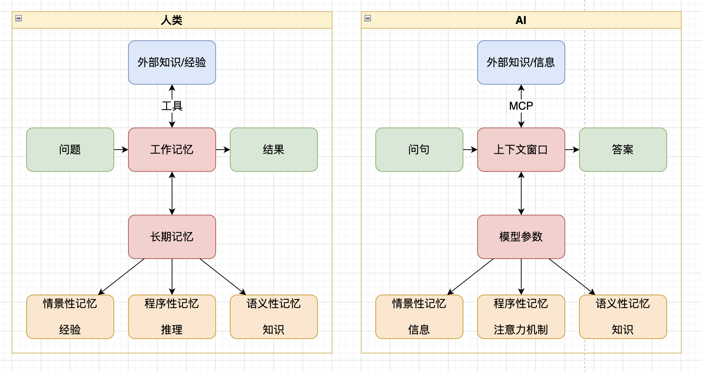
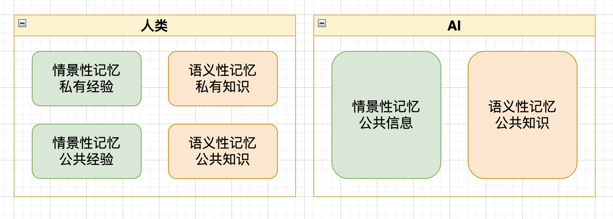
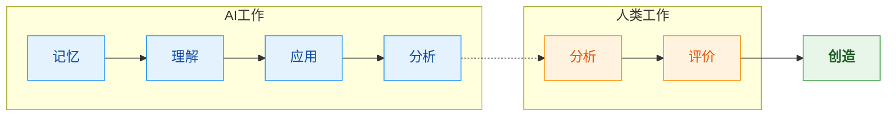
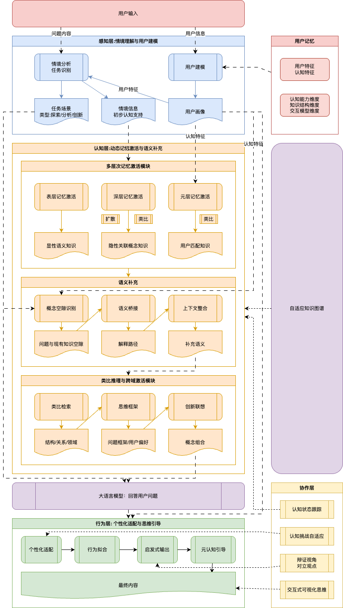
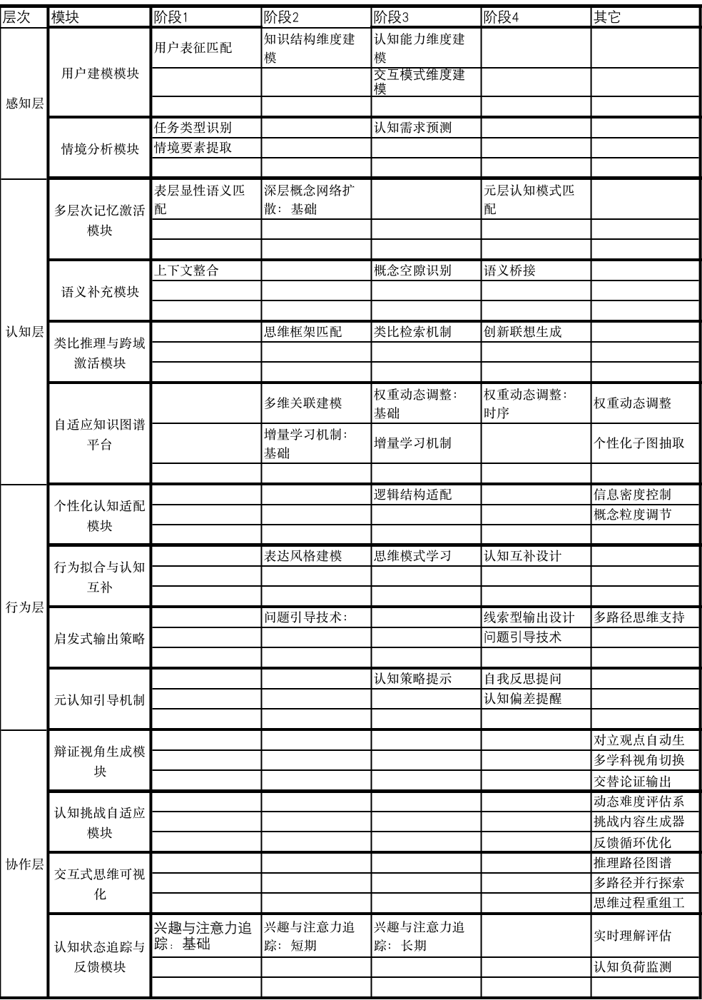

   记忆-认知协同系统设计

[toc]

# 第一章：系统设计背景

在人类复杂而精妙的思维活动中，**记忆**从来不是一个被动、静态的信息储存容器。它是一个具备高度动态性与参与性的系统，贯穿并支持着人类的**认知、决策与创造**全过程。记忆不仅仅承载着过去的痕迹，它更是当下意义建构的基础、情境理解的核心、未来预测的前提。在每一次推理、判断与行动中，相关经验会被迅速调取，概念被情境化，碎片化的线索也能迅速整合为具备解释力的结构。这种激活与加工过程并非线性推进，而是**多层次、并行处理、语境驱动**的认知机制集合，通常伴随着语义关联、情感加权、注意力调度、目标导向等协同机制的运行。

因此，记忆并非附属组件，而是构成**认知系统核心架构**的中枢。在真实人类认知中，它既是知识的组织器，也是行为的调度者，还是创造性加工的引擎。它连接着感知输入与行为输出，贯穿感性与理性之间的桥梁。忽视记忆的复杂结构与功能，无疑将导致对整个认知系统的理解与建构陷入片面甚至误导。

随着大模型技术的演进进入深水区，**记忆的重要性愈加突出**。现有系统大多关注如何构建"外部记忆"或"长期记忆模块"，其核心仍围绕**"如何存储"**，包括语料压缩、知识持久化、嵌入向量缓存等技术手段。然而，真正具有人类水平的认知系统，其关键并不在于是否记住全部细节，而在于能否**选择性地记住关键内容，并能在需要时恰当地激活并重新组织**，进而服务于当前的任务目标与情境要求。

换句话说，我们更应关注的不是"记住了什么"，而是"**在何种情境下，如何使用这些记忆**"。这一能力的核心，在于系统是否能进行**语义补全、情境推理与知识重构**，是否能模拟人类在面对复杂问题时对知识进行再解释、再整合、再生成的能力。这样的能力，是推动AI真正参与认知的关键一步。

然而，当前广泛采用的RAG（Retrieval-Augmented Generation）框架，尽管在文本生成中引入了知识增强机制，但其**认知行为模式依然属于静态信息匹配**。每次面对新问题，系统从"记忆库"中检索相关段落，再拼接进提示中辅助大模型作答。这种方式**没有真正实现语境下的记忆动态激活与深度重组**，也缺乏对多轮思考中"记忆演化"的支持机制。更重要的是，它无法模拟人类在面对模糊、不完整、不确定问题时，通过记忆完成的**推理补全与概念构建**过程。

目前的发展方向正在尝试引入**知识图谱**以提升信息结构化与可用性，将实体、事件与属性关系以图的形式存储，以增强知识调用效率。但多数实现依然局限在**"数据技术"层面**，尚未触及"认知模拟"的深层机制。图谱中实体之间的连接，往往缺乏时序性、情境性、目的性等认知维度，难以支撑人类思维中多义、多尺度、多目标的动态建构过程。而在认知心理学与神经科学领域，关于人脑如何通过分布式表征、概念网络、神经激活模式实现记忆调用的研究，为AI系统的建模提供了更广泛的跨领域视角和启发。

**摒弃以技术为导向的存储中心思维，转向以认知机制为核心的应用导向模式**。我们必须从"记忆作为知识存储"的思维模式，转向"记忆作为认知驱动器"的理解视角。这意味着记忆系统不仅要记录信息，还必须理解、加工与重构信息，并能**在任务执行过程中与大模型协同演化与反思性调用**。

本系统的设计正是立足于这样的理念：不仅仅从技术实现角度讨论"如何构建记忆系统"，而是回归到**认知需求与业务场景的本质问题**上，探讨AI如何参与、协同并扩展人类的认知过程。核心关注点不在于让AI"具备记忆功能"，而在于让**AI激活、加工、组合与运用记忆**，以支持任务导向的语义补全、语境建模与推理生成。

具体而言，系统将通过构建具备**记忆过滤与重构能力、语义显化与联想能力、认知补全与放大能力**，实现从数据存储走向知识演化，从孤立回答走向连续认知，从被动调用走向主动生成的转变。最终目标是让AI成为**认知的协作者**，而非信息重复器。

这也意味着从"AI辅助人类完成任务"迈向"**AI与人类共构认知体系**"。人机协同不应只停留在任务分工层面，而应上升为**思维共生系统**：在人类知识背景与情境判断的基础上，AI通过记忆系统参与建模、补全与推理，共同生成创新性认知成果，从而实现"1+1远远大于2"的协同效应。这正是**记忆-认知协同系统**设计的根本愿景与驱动力。

# 第二章：人类与AI的记忆机制对比分析

这是一张人类思考过程与AI推理过程的对比图，我们可以发现一些有趣的现象。

图1：人类与AI推理机制对比

## 2.1 外部知识的获取机制

- **人类**通过**工具**（如语言、书籍、计算机等）与外部知识和经验建立连接，并可据此不断扩展工作记忆和长期记忆的容量。
- **AI**则通过**MCP（Model Context Protocol）**等桥接机制获取外部信息资源，实现对知识库、数据库、网页等的访问。

## 2.2 输入输出机制的对应

- 无论是人类还是AI，其认知过程通常都从**问题/问句**开始，经过内部处理后，最终生成**结果/答案**。
- 人类输出的结果往往表现为**元符号结构**（如概念、模型、语言），而AI模型输出的答案同样是可解释的语言或结构化内容，两者在表达层上具有高度一致性。

## 2.3 工作记忆的处理过程

- **人类的工作记忆**承担问题的暂存、加工与思维操作任务，具有高度动态性。它不断地与**长期记忆**进行交互，调用经验、知识与推理能力完成任务。
- **AI的上下文窗口（Context Window）**承担与工作记忆相近的功能，负责暂存当前问题相关的信息、提示与中间过程。虽然上下文窗口的表达方式与人类不同，但在结构与功能上具有相似性。
- 值得注意的是，随着**ReAct**或**Reactor Agent**等Agent机制的发展，AI在工作记忆层级的模拟能力已趋近人类，可以执行连续、内外数据频繁交换的复杂任务。

## 2.4 长期记忆结构的比较

人类与AI均具备三种长期记忆构成：

1. **情景性记忆（Episodic Memory）**：
   - 人类主要表现为**经验积累**，对具体事件、情境的记忆。
   - AI则存储原始训练语料中所包括的公共信息，作为情境参考。

2. **程序性记忆（Procedural Memory）**：
   - 人类依靠推理能力，如演绎、归纳与类比，形成操作性知识。
   - AI则通过**注意力机制**动态分配模型资源，对输入内容进行结构化加工，虽然从底层上，主要使用归纳、类比等方式，但在宏观上，已经涌现出类似推理的效果。

3. **语义性记忆（Semantic Memory）**：
   - 人类的语义性记忆是对知识、概念的系统性存储。
   - AI的语义性记忆则由**模型参数**所承载，是其训练过程中内化的知识表达。

## 2.5 记忆类型中的私有性与公共性差异

图2：人类与AI在情景记忆、语义记忆上的差异对比

在对比人类与AI的记忆结构时，进一步细分**情境性记忆**与**语义性记忆**可以发现，它们在"私有性"与"公共性"维度上存在显著差异：

## 情境性记忆的差异

- **人类的情境性记忆**具有**高度私有性**，包含个体独特的主观体验、具身认知过程与生活经验。这些记忆是个体化的、不可复制的，例如童年的一场雨、与朋友的对话、考试时的紧张情绪等。
- **AI的大模型**缺乏此类私有体验，它的情境性记忆仅限于**公共信息**，如用户历史输入、任务上下文等，无法感知或存储个体的情绪、身体状态或主观视角。

## 语义性记忆的差异

- **人类的语义性记忆**由两部分构成：
   - **私有知识**：个体通过自身经验、兴趣与理解所积累的个性化知识结构；
   - **公共知识**：由社会共识构建的系统性知识，如语言、科学、文化传统。
- **AI的语义性记忆**几乎全部来自于**公共知识语料**，包括百科、学术论文、新闻文章、论坛对话等，其结构广泛、系统、覆盖面极大，几乎囊括了现代人类社会中可获取的优质知识。

## 对比总结

表1：人类与AI记忆类型对比

| **维度**     | **人类**               | **AI大模型**           |
| ------------ | ---------------------- | ---------------------- |
| 情境性记忆   | 私有经验 + 公共经验    | 公共信息（无私有经验） |
| 语义性记忆   | 私有知识 + 公共知识    | 公共知识为主           |
| 私有性       | 强（主观体验丰富）     | 弱（无个体意识）       |
| 公共覆盖范围 | 有限，受限于教育与接触 | 极广，涵盖全球知识资源 |

## 2.6 设计启示

通过以上对比分析，我们可以得出以下启示：

- 人类的优势在于具身经验、情感记忆与个性化知识建构；
- AI的优势在于广泛覆盖、可扩展性强的公共信息、知识网络；
- 人类与AI在**记忆类型、结构分工与获取方式**上的高度对应，但也突显了两个关键差异：
   - **情景性记忆**：人类通过主观经验与具身认知积累情境知识，而AI则需要借助明确标注或结构化上下文才能实现相似效果。
   - **语义性记忆**：人类可以通过不断学习重塑语义网络，而AI的知识更新仍受限于训练周期与上下文长度。但由于AI的庞大公共知识，使它能够处理更广泛场景（对比人类）的问题。

这些差异正是本系统设计需要重点弥合的认知鸿沟。

# 第三章：设计目标及设计思路

从AI的特征来看，可以预言未来随着AI不停介入人类的工作生活，整体的工作方式会产生巨大的变化：

AI将大量代替人类在记忆、理解、应用以及基本分析上的工作，人类则通过深度分析、评价（ai的产出），达到人机共创的目的。而人类所需要的分析、评价能力都依赖于认知、元认知能力。

基于以上观点，我们提出系统建设的三条核心指导原则：

- 应注入用户的私有经验与知识，使AI能够贴合用户个性化的思维方式进行理解与回应；
- 借助AI对公共知识的广泛覆盖能力，弥补用户在认知过程中可能存在的知识盲区，实现智能协作中的知识放大与认知增强；
- 考虑到人类思维的注意力漂移特性，系统需动态追踪用户的短期与长期注意力状态，精准把握其关注焦点，而非仅凭静态上下文或完整知识库进行推理。

这些启发共同指向一种以用户为中心、动态适配的智能协同机制。

## 3.1 目标1：语义补全

**目标**：通过深度用户画像、上下文语义分析及外部信息整合，识别用户问题中的隐含语义和背景知识缺失。

**边界范围**：聚焦于个性化的语境理解，不涉及用户自身决策的替代。

**前提条件**：具有明确的认知需求和稳定的知识结构等用户画像信息。

**实现策略**：

- 在感知层提取用户的专业背景、兴趣偏好、表达习惯
- 识别任务情境中可能存在的具身体验与主观认知特征
- 将用户的认知状态与具体问题语境精准输出，作为认知层的基础输入
- 精确分析用户问题中的隐性语义空缺、背景前提与隐含知识链

## 3.2 目标2：认知放大机制

**目标**：主动提供启发性联想、结构化的思考路径以及概念网络的动态扩展，强化用户思考的深度与广度。

**边界范围**：系统提供认知辅助而非直接决策。

**前提条件**：识别出用户具有探索性、分析性或创新性的复杂任务需求。

**实现策略**：

- 基于自适应知识图谱，实现语义的深层次补充与上下文动态整合
- 利用仿人类的类比、演绎、归纳等程序性记忆机制，动态生成从旧知识到新问题的语义桥接路径
- 根据用户认知盲区，提供针对性的启发与扩展建议
- 主动提供多视角、多路径思考线索，鼓励用户深度、主动的认知参与与反思

## 3.3 目标3：注意力转移适应

**目标**：动态识别用户兴趣变化与认知焦点切换，调整信息组织和交互策略。

**边界范围**：关注动态语义调整和互动策略，不涉及用户决策主导。

**前提条件**：用户持续参与多轮对话或面临任务情境频繁切换。

**实现策略**：

- 实时识别用户兴趣变化与认知焦点切换
- 动态调整信息组织和交互策略
- 动态适配用户的思维风格，精确控制输出信息的密度与逻辑结构

## 3.4 设计思路

在认知科学的视角下，人类的思维过程具有层次性、情境性与动态激活的特点，强调感知—认知—行动之间的连续加工与反馈调节。本系统即借此理念，构建"感知层—认知层—行为层"三层架构，以模拟人类在真实情境中完成理解、记忆调用、推理决策与行为表达输出的过程，为后继采取行为提供支持。此外加入辩证视角等增强模块、认知状态追踪等跨层运行模块，共同构成"协作层"支撑和扩展这三层架构的能力。

- **感知层**模拟人类对外部世界的知觉与自我意识觉察，聚焦于用户的个体语境建模与情境理解，实现对私有经验、偏好、关注点的动态感知；
- **认知层**对标人类大脑中前额叶等区域的记忆调用与概念重组机制，构建语义补全引擎，调动长期记忆与工作记忆中的相关信息，生成符合当前语境的认知结构；
- **行为层**则模拟人类在语言表达与问题解决中的意图执行与策略调节，结合AI的结构化能力与表达优势，为用户提供个性化、启发性的认知支持。
- **协同层**提供如认知状态追踪跨层、跨对话的支持，保证多轮对话（多次三层架构）情境下的连续性。或者辩证视角等哲学角度等功能，进一步扩展原行为层的能力。

AI在这一架构中的介入，并非简单替代人类认知，而是作为一个"认知助理"动态嵌入每一层加工流程，发挥其在信息覆盖广度、逻辑整合能力与表达优化等方面的优势。系统通过模块化的方式设计信息流与控制流，使AI能精准介入人类思维链条的薄弱环节，如语境缺失、注意力漂移或表达障碍，从而实现认知过程的补全、扩展与重构，真正实现"类人认知机制+机器优势介入"的深度融合。

  
  图3： 认知-记忆协同框架图

# 第四章：感知层设计

感知层作为整个系统的前端，负责理解当前用户的情境和状态，为后续记忆激活提供精准线索。这一层的设计充分考虑了人类认知的私有性特征，力图通过多维度建模来捕捉用户独特的认知背景和当前需求。

## 4.1 用户建模模块

用户建模模块构建多维度的动态用户画像，为实现个性化记忆激活提供基础。该模块不仅关注用户的静态属性（参考《用户表征框架》），更重要的是捕捉其动态的认知特征和思维模式（《用户表征框架》元认识）。

### 4.1.1 认知能力维度建模

**功能设计**：评估用户的抽象思维能力、逻辑推理偏好、概念联想习惯等认知特征。

**实现机制**：

- **思维模式识别**：通过分析用户的问题表述方式、论证结构、概念使用习惯，判断其偏好形象思维还是演绎推理
- **认知复杂度评估**：根据用户处理多层次概念、理解抽象关系的表现，动态评估其认知处理能力
- **创造性思维倾向**：识别用户在面对问题时是倾向于收敛性解决还是发散性探索

**数据来源**：

- 用户历史对话中的推理链条分析
- 概念使用的抽象层次统计

### 4.1.2 知识结构维度建模

**功能设计**：获取用户的专业背景、身份、能力等信息，分析经验深度、知识框架，构建个性化知识图谱。

**实现机制**：

- **领域知识映射**：识别用户在不同知识领域的专业程度，构建多层次知识地图
- **知识边界识别**：通过交互中的理解反馈，动态标记用户的知识边界和盲点
- **跨域知识连接**：分析用户在不同领域知识间建立联系的能力和偏好

**知识图谱构建**：

- 核心概念节点：用户频繁使用和深入理解的概念
- 边缘概念节点：用户接触但理解不深的概念
- 潜在扩展区域：基于用户兴趣可能探索的新知识领域

### 4.1.3 交互模式维度建模

**功能设计**：了解用户的思维节奏、信息接受偏好、认知负荷阈值。

**实现机制**：

- **信息处理速度**：监测用户对不同复杂度信息的响应时间和理解深度
- **注意力模式**：识别用户是偏好深度聚焦还是广度扫描的注意力分配方式
- **认知节奏适配**：根据用户的思考和响应节奏，调整系统的信息呈现速度

**适应性调整**：

- 信息密度动态控制
- 概念引入的渐进性设计
- 认知负荷的实时监测与调节

> [!IMPORTANT]
>
> 该维度建模依赖对用户响应时间、注意力分布等精细交互数据的持续监测，较适用于教育培训等高频互动场景。在日常办公等低频、碎片化环境下，难以稳定采集数据，实施成本较高。因此可转为基于静态画像的轻量建模，提供基本适配性。

## 4.2 情境分析模块

情境分析模块识别用户当前所处的任务场景和问题意图，为认知层的记忆激活提供方向性指导。

### 4.2.1 任务类型识别

**功能定位**： 识别用户任务的认知类型，为系统匹配合适的支持策略与资源提供任务导向基础。

**探索型任务特征识别**

- **开放性问题表述**: 问题通常以"如何看待……""可能有哪些……"等形式出现，暗示没有唯一正确答案，需要发散性思维。
- **缺乏明确目标或评价标准**: 任务目标模糊，评估标准主观性强，侧重探索过程而非最终结论。
- **需要创造性思维和多角度分析**: 要求从不同维度、不同角色或视角进行审视，激发新观点或未被察觉的可能性。

**分析型任务特征识别**

- **结构化问题表述**: 常用"分析……的原因""比较A与B"等表述，明确要求逻辑上的拆解与组织。
- **有明确的逻辑框架需求**: 解答过程中通常要求建立清晰的逻辑链条，如因果关系、对比结构或分类体系。
- **需要系统性思维和严谨推理**: 强调对信息的整合与证据的论证，避免主观臆断，侧重结构合理和结论严密。

**创新型任务特征识别**

- **跨领域问题表述**: 题干中常出现不同领域之间的连接，如"是否能将A的机制应用于B场景"，推动知识迁移。
- **寻求突破性解决方案**: 关注在现有方案之外提出新的路径，强调对"已知"的超越。
- **需要类比思维和概念重组**: 借助对熟悉领域的理解类比陌生领域，同时对概念进行重构，以生成新颖解法。

> [!NOTE]
>
> 检索型任务，即获得公共信息或者公共知识的语义，是最为常见的任务。问题特征较为简单，不单独罗列。
>
> 但在AI引导下，可向其它任务类型迁移。后期可考虑在教育、培训相关应用场景下使用。

### 4.2.2 情境要素提取

**功能定位**： 提取任务情境中的关键维度，构建问题理解框架，为后续认知支持与策略匹配提供语境基础。

**时间维度分析**

- **问题的时效性要求**: 判断任务是否与特定时间窗口紧密相关，如是否需要回应当前事件或热点问题。
- **历史背景的相关性**: 考察问题是否依赖于对过去事件、发展过程或演化趋势的理解，强调历史视角。
- **未来导向的程度**: 识别任务是否强调预测、设想或规划未来情境，体现前瞻性与战略思维。

**空间维度分析（隐喻）**

- **问题涉及的领域范围**: 明确任务集中于单一专业领域，还是涵盖多个学科领域，影响问题复杂度。
- **跨学科的程度**: 分析是否需要结合不同知识体系（如技术+伦理、经济+文化），以形成综合性解决方案。
- **抽象层次的定位**: 判断问题是在操作层面、概念层面还是元层（如方法论、价值观），对应不同思维深度。

**目的维度分析**

- **理解型需求 vs 应用型需求**: 区分任务是以获取知识、澄清概念为目的，还是以解决实际问题、实现功能为导向。
- **验证型思考 vs 探索型思考**: 判断任务是否聚焦于已有理论的检验与确认，或更偏向开放式探索与假设生成。
- **目标达成 vs 环境适配 vs 个人成长**: 分析任务目标是强调结果导向（完成任务）、适应外部情境（灵活应变），还是推动学习者内在发展（能力提升、认知扩展）。

### 4.2.3 认知需求预测

**功能定位**：识别认知障碍，匹配支持资源，辅助用户高效理解与深度思考。

**知识补充需求**

- **概念定义的澄清**: 用户可能对任务中核心术语理解模糊，需要提供清晰、权威的定义以统一语义基础。
- **背景知识的补充**: 任务涉及相关领域的基础信息、历史脉络或现实背景，用户需获得简明扼要的介绍以便开展推理。
- **相关理论的引入**: 为支持论证或深化理解，用户可能需要了解领域内的重要模型、经典理论或研究成果。

**思维框架需求**

- **分析框架的提供**: 任务需要系统性分解问题，用户可能依赖常见的结构化工具，如SWOT、因果链、五力分析等。
- **思考路径的引导**: 用户可能不清楚如何着手，需要被引导明确"先观察—再分类—再推理"或"设问—假设—验证"等基本流程。
- **决策模型的支持**: 在面对多方案选择或复杂判断时，用户可能需要提供如决策树、成本-效益权衡表等结构化判断工具。

**创意激发需求**

- **类比案例的提供**: 类似情境中的解决方式或现象可作为启发素材，帮助用户迁移已有经验。
- **跨域联想的促进**: 通过引入其他领域（如艺术、自然、商业）的元素，打破固有思维边界，激活新联结。
- **反常规思维的引导**: 鼓励用户从对立面、悖论或不合理设想出发，颠覆预设认知模式，产生创新想法。

## 4.3 感知层的集成输出

感知层通过整合用户建模和情境分析的结果，生成一个综合的认知情境描述，包括：

1. **用户认知画像**：当前用户的认知能力、知识结构和交互偏好的综合描述
2. **任务特征向量**：当前任务的类型、复杂度、创新性等多维度特征
3. **认知支持建议**：基于用户和任务匹配分析得出的初步认知支持策略

这些输出将作为认知层进行记忆激活和语义补充的关键输入，确保后续的认知支持精准且个性化。

# 第五章：认知层设计

认知层是整个系统的核心，负责依据感知层提供的用户模型和情境信息，从记忆库中动态激活相关记忆并对其进行语义层面的加工补充。这一层的设计突破了传统RAG系统的局限，实现了从"信息匹配"到"认知协同"的飞跃。

> [!note]
>
> 此处技术实现，均可由大语言模型作为替代方案。当大模型无法处理的场景（如数据量过大、推理精度要求等），需要引入其它的传统技术，作为补充

## 5.1 多层次记忆激活模块

系统采用表层-深层-元层三层记忆激活机制，模拟人类记忆的层次性组织和激活过程。

### 5.1.1 表层激活：显性语义匹配

**功能定位**：基于关键词和显性语义的直接匹配检索，快速提供与问题明显相关的知识片段。

**技术实现**：

- **语义向量匹配**：使用先进的嵌入模型将查询和知识片段转换为高维向量，通过余弦相似度等度量进行匹配
- **关键词增强**：结合TF-IDF等传统方法，确保重要术语的精确匹配
- **上下文环境**：考虑查询的前后文信息，提高匹配的准确性

### 5.1.2 深层激活：概念网络扩散

**功能定位**：基于概念网络的关联扩散检索，突破表层关键词限制，找到潜在相关的知识。

**技术实现**:

- **知识图谱构建与管理**：基于RDF/OWL等语义网技术构建概念图，借助图数据库高效存储与查询概念关系。
- **图算法支持的扩散计算**：利用图遍历与传播算法实现概念节点间的逐层扩散与强度衰减模拟。
- **语义关系推理与约束计算**：结合本体推理引擎进行语义类型判断、方向性限制与路径有效性验证。
- **向量化与语义嵌入融合**：引入概念嵌入模型增强概念间潜在关联捕捉能力，提升扩散结果的语义相关性。

**扩散机制设计**：

- **一阶扩散**：从直接匹配的概念出发，激活其直接关联的概念节点
- **多阶扩散**：通过设定的扩散深度，逐层激活更远距离的相关概念
- **激活强度衰减**：随着扩散距离增加，激活强度按照特定函数衰减

**关联类型处理**：

- **语义关联**：同义、上下位、部分整体等语义关系
- **功能关联**：因果、条件、目的等功能关系
- **时空关联**：时间序列、空间邻近等关系
- **经验关联**：基于用户历史交互建立的个性化关联

**扩散控制机制**：

- **方向性约束**：根据任务类型限定扩散方向
- **强度阈值**：设置最小激活强度，避免噪声
- **路径剪枝**：移除循环路径和低相关路径

### 5.1.3 元层激活：认知模式匹配

**功能定位**：基于认知模式的记忆定位，确保检索结果与用户的认知方式契合。

**认知模式库构建**：

- **思维框架模板**：归纳总结不同领域和任务的典型思维模式
- **推理路径模式**：提取常见的推理链条和论证结构
- **问题解决模式**：整理各类问题的标准解决流程

**模式匹配机制**：

- **模式识别**：分析当前问题与已知认知模式的相似度
- **模式组合**：支持多个模式的灵活组合使用
- **模式适配**：根据用户特征调整模式的具体表现

**个性化优化**：

- 基于用户历史偏好的模式权重调整
- 动态学习用户新的认知模式
- 跨用户的模式推荐和迁移

## 5.2 语义补充模块

在检索到初步记忆片段后，系统对其进行深度的语义加工，构建完整的认知支持。

### 5.2.1 概念空隙识别

**识别维度**：

- **知识完整性检查**：前提条件是否明确，推理链条是否完整，结论依据是否充分

- **概念理解深度评估**：专业术语的定义需求，抽象概念的具象化需求，复杂关系的分解需求

- **认知跨度分析**：从已知到未知的距离，需要的中间概念数量，认知跳跃的难度

**技术实现**：

- **知识图谱遍历**：检查概念间的连通性
- **依赖分析**：识别理解新概念所需的前知识
- **用户知识建模**：对比用户已知和目标知识的差距

### 5.2.2 语义桥接

**桥接策略设计**：

- **类比桥接**：寻找用户熟悉领域的相似概念，构建"A之于B，如同C之于D"的类比结构，迁移已知领域的理解模式

- **渐进桥接**：设计从简单到复杂的概念序列，每步只引入一个新概念，确保每步都在用户的最近发展区内

- **多路径桥接**：提供多条理解路径供选择，不同路径对应不同的认知风格，支持路径间的切换和组合

**桥接质量保证**：

- 路径的认知负荷评估
- 概念引入顺序的优化
- 桥接效果的实时验证

### 5.2.3 上下文整合

**整合层次**：

- **局部整合**：段落级别的信息组织；保持局部逻辑的连贯性；处理代词指代等局部依赖

- **全局整合**：跨段落的主题一致性；整体论述结构的合理性；前后观点的呼应关系

- **认知整合**：与用户认知框架的对接；新旧知识的有机结合；认知冲突的识别和处理

**整合技术**：

- **模板驱动**：使用领域特定的组织模板
- **连贯性检查**：确保信息流的自然过渡
- **冗余消除**：去除重复和矛盾信息

## 5.3 类比推理与跨域激活模块

类比推理是人类认知的核心机制之一，系统通过深度模拟这一机制实现创新性思维支持。

### 5.3.1 类比检索机制

**相似性识别**：

- **关系/结构类比**：抽象出问题中的核心关系结构
- **跨域映射**：在不同领域中寻找相同的关系模式
- **相似度计算**：综合考虑表面相似和结构相似

**类比源选择策略**：

- **认知距离优化**：选择用户容易理解但又有启发性的类比源
- **创新度平衡**：在熟悉性和新颖性之间找到平衡
- **多样性保证**：提供来自不同领域的多个类比

### 5.3.2 思维框架匹配

**框架识别与选择**：

- **问题框架分析**：识别问题隐含的思维框架需求
- **用户框架偏好**：考虑用户的认知风格和领域背景
- **框架推荐算法**：基于效用最大化选择最合适的框架

**框架适配与定制**：

- **参数调整**：根据具体问题调整框架参数
- **要素映射**：将问题要素映射到框架结构
- **边界处理**：识别框架适用性的边界条件

### 5.3.3 创新联想生成

**联想触发机制**：

- **远距离联想**：连接概念空间中距离较远的节点
- **随机游走**：在概念网络中进行受控的随机探索
- **组合创新**：系统性地组合不同领域的概念

**创新性评估**：

- **新颖度度量**：评估生成联想的独特性
- **相关度保证**：确保联想与原问题的关联性
- **可行性检验**：初步评估创新想法的现实可行性

## 5.4 自适应知识图谱平台

知识图谱作为认知层的核心基础设施，需要具备高度的适应性和动态性。

> [!NOTE]
>
> 在数据规模不大的情况下，可以用大模型作为简易平台，提供基本知识图谱功能

### 5.4.1 多维关联建模

**关系类型体系**：

- **本体关系**：定义概念间的本质联系

   - 分类关系（is-a）

   - 组成关系（part-of）

   - 属性关系（has-property）

- **认知关系**：反映人类理解中的联系

   - 类比关系（similar-to）

   - 对比关系（contrast-with）

   - 前提关系（requires）

- **功能关系**：描述概念的作用和影响

   - 因果关系（causes）

   - 目的关系（used-for）

   - 条件关系（depends-on）

**关系强度建模**：

- 静态强度：基于领域知识的固定权重
- 动态强度：基于使用频率的自适应权重
- 情境强度：根据当前任务的临时权重

### 5.4.2 个性化子图抽取

**子图构建策略**：

- **兴趣驱动**：以用户兴趣点为中心扩展
- **任务导向**：围绕当前任务需求构建
- **历史积累**：整合用户历史交互涉及的知识

**子图优化算法**：

- **覆盖度优化**：确保包含必要的知识节点
- **连通性保证**：维护子图的内部连通性
- **规模控制**：平衡完整性和计算效率

### 5.4.3 权重动态调整

**调整触发机制**：

- **使用反馈**：根据知识使用效果调整权重
- **时间衰减**：降低长期未使用知识的权重
- **情境变化**：任务切换时重新评估权重

**学习算法设计**：

- **强化学习**：基于用户满意度的奖励信号
- **协同过滤**：借鉴相似用户的权重模式
- **迁移学习**：跨领域迁移成功的权重模式

### 5.4.4 增量学习机制

**新知识集成**：

- **概念识别**：从交互中提取新概念
- **关系发现**：识别新的概念间联系
- **冲突解决**：处理新旧知识的矛盾

**质量控制机制**：

- **可信度评估**：评估新知识的可靠性
- **一致性检查**：确保与现有知识的兼容
- **版本管理**：支持知识的回滚和比较

# 第六章：行为层设计

行为层负责将认知层的处理结果转化为对用户有效的交互输出，是系统"**认知放大**"理念的直接体现。这一层的设计注重个性化、启发性和元认知支持。

## 6.1 个性化认知适配模块

该模块确保系统输出与用户的认知特征高度匹配，实现真正的个性化交互。

### 6.1.1 信息密度控制

**密度评估维度**：

- **概念密度**：单位内容中新概念的数量
- **逻辑密度**：推理步骤的紧密程度
- **细节密度**：具体信息的丰富程度

**动态调控机制**：

- **用户能力适配**：

   - 专家用户：高密度、跳跃式信息组织

   - 中级用户：适度密度、渐进式展开

   - 初学者：低密度、详细解释每个步骤

- **任务需求适配**：

   - 概览任务：突出要点，隐藏细节

   - 深入分析：展开论述，提供证据

   - 快速决策：精炼信息，直达结论

- **认知状态适配**：

   - 高负荷时：降低密度，分段呈现

   - 最佳状态：适度挑战，保持engagement

   - 疲劳状态：简化表达，提供总结

**实现设计**：

- **内容分层**：将信息组织为多个层次
- **渐进展开**：支持用户按需深入
- **智能摘要**：自动生成不同详略程度的版本

### 6.1.2 逻辑结构适配

**思维模式匹配**：

- **线性思维者**：

   - 按时间或因果顺序组织

   - 明确的开始、中间、结束

   - 步步推进的论证方式

- **网状思维者**：

   - 多中心的信息组织

   - 丰富的交叉引用

   - 支持非线性探索

- **层次思维者**：

   - 清晰的层级结构

   - 从总到分的展开

   - 便于把握全局

**表达形式优化**：

- **视觉型用户**：图表、类比、形象化表达
- **听觉型用户**：对话式、韵律感、故事化
- **逻辑型用户**：公式化、符号化、形式化

**结构转换能力**：

- 同一内容的多种组织方式
- 用户可切换的呈现模式
- 保持内容一致性的结构变换

### 6.1.3 概念粒度调节

**粒度层次设计**：

- **宏观层**：领域全貌、核心理念
- **中观层**：主要概念、关键联系
- **微观层**：具体细节、操作要素

**动态粒度选择**：

- **初次接触**：从宏观开始，建立整体认识

- **深入理解**：逐步细化，填充细节

- **实际应用**：聚焦操作层面的具体知识

**粒度切换机制**：

- 上钻（drill-up）：从细节到概括
- 下钻（drill-down）：从概括到细节
- 平移（lateral move）：同层次的相关概念

## 6.2 行为拟合与认知互补

该模块在贴近用户的基础上，提供认知上的互补支持。

### 6.2.1 思维模式学习

**模式识别维度**：

- **论证风格**：

   - 归纳型：从事例到原理

   - 演绎型：从原理到应用

   - 类比型：通过相似性推理

- **问题处理方式**：

   - 分析型：分解问题，各个击破

   - 综合型：整体把握，系统思考

   - 直觉型：依靠经验和感觉

- **决策偏好**：

   - 理性分析：基于逻辑和数据

   - 情感驱动：考虑价值和感受

   - 实用主义：关注可行性和效果

**学习机制设计**：

- **模式挖掘**：从历史交互中提取模式
- **模式验证**：通过A/B测试验证效果
- **模式更新**：随用户成长动态调整

### 6.2.2 表达风格建模

**语言特征分析**：

- **词汇选择**：专业术语vs通俗用语
- **句式结构**：简单直白vs复杂精确
- **修辞手法**：理性陈述vs生动比喻

**风格要素提取**：

- **正式度**：学术严谨vs轻松随意

- **具体度**：抽象概括vs具体案例

- **情感度**：客观中立vs情感丰富

### 6.2.3 认知互补设计

**互补策略框架**：

- **思维盲点补充**：

   - 线性思考者→提供发散视角

   - 局部关注者→展示全局联系

   - 经验主义者→引入理论框架

- **认知偏差纠正**：

   - 确认偏误→呈现反面证据

   - 可得性偏差→提供全面数据

   - 锚定效应→多角度参照点

- **能力边界拓展**：

   - 在舒适区边缘提供挑战

   - 搭建通向新领域的桥梁

   - 激发潜在的认知能力

**互补强度控制**：

- 渐进式引入不同视角
- 根据接受度调整互补程度
- 保持支持性而非对抗性

## 6.3 启发式输出策略

系统采用启发式策略，促进用户的主动思考和深度理解。

### 6.3.1 线索型输出设计

**线索层次结构**：

- **方向性线索**：指出思考的大方向；提示相关的知识领域；暗示可能的解决路径

- **关联性线索**：揭示概念间的隐含联系；提供类比和比喻；展示不同视角的关联

- **启发性问题**：引导深入思考的问题；挑战假设的反问；促进反思的元问题

**线索呈现策略**：

- **渐进揭示**：从模糊到清晰
- **多线索并列**：提供多种可能性
- **交互式探索**：根据反馈调整线索

### 6.3.2 多路径思维支持

**路径设计原则**：

- **多样性保证**：

   - 理论路径vs实践路径

   - 正向思考vs逆向思考

   - 收敛思维vs发散思维

- **可比性设计**：

   - 统一的评估维度

   - 清晰的优劣对比

   - 适用条件的说明

- **组合性支持**：

   - 路径间的衔接点

   - 混合策略的可能性

   - 动态路径调整

### 6.3.3 问题引导技术

**问题类型设计**：

- **澄清性问题**：

   - "你所说的X具体指什么？"

   - "能否举例说明？"

   - "这与Y有何不同？"

- **拓展性问题**：

   - "如果条件改变会如何？"

   - "还有哪些可能性？"

   - "从另一个角度看呢？"

- **深化性问题**：

   - "背后的原因是什么？"

   - "这意味着什么？"

   - "核心问题在哪里？"

**问题序列编排**：

- 由浅入深的递进
- 由具体到抽象的提升
- 由局部到整体的扩展

## 6.4 元认知引导机制

帮助用户认识和改进自己的思维过程，提升元认知能力。

### 6.4.1 认知策略提示

**策略知识库**：

- **问题解决策略**：

   - 分解策略：大问题分解为小问题

   - 类比策略：寻找相似问题的解法

   - 逆向策略：从目标倒推到起点

- **学习策略**：

   - 精细加工：建立知识间的联系

   - 组织策略：构建知识的结构

   - 元认知监控：评估理解程度

- **创新策略**：

   - SCAMPER技法

   - 六顶思考帽

   - 思维导图法

**策略推荐算法**：

- 基于任务特征的匹配
- 考虑用户偏好和能力
- 评估策略的适用性

**策略指导方式**：

- 明确的策略说明
- 隐含的示范引导
- 互动式策略练习

### 6.4.2 自我反思提问

**反思框架设计**：

- **过程反思**：

   - "我是如何得出这个结论的？"

   - "思考过程中有哪些关键转折？"

   - "哪些因素影响了我的判断？"

- **结果反思**：

   - "这个答案解决了原问题吗？"

   - "还有哪些方面没有考虑？"

   - "结论的可靠性如何？"

- **方法反思**：

   - "采用的方法是否最优？"

   - "有哪些替代方法？"

   - "下次可以如何改进？"

**反思引导技巧**：

- 适时而非频繁
- 建设性而非批判性
- 具体而非抽象

### 6.4.3 认知偏差提醒

**偏差识别系统**：

- **常见认知偏差库**：

   - 确认偏误及其表现

   - 可得性启发式偏差

   - 过度自信偏差

   - 沉没成本谬误

- **偏差检测算法**：

   - 基于行为模式的识别

   - 基于语言表达的分析

   - 基于决策结果的推断

- **情境化偏差评估**：

   - 考虑具体任务背景

   - 评估偏差的影响程度

   - 判断干预的必要性

**偏差提醒策略**：

- **温和提示**：不直接指出，而是引导察觉
- **证据呈现**：提供客观数据和多元视角
- **替代思路**：展示无偏差的思考方式

**提醒时机选择**：

- 决策前的预防性提醒
- 过程中的纠偏提示
- 结果后的反思引导

# 第七章：协作层与机制设计

协作层由多个模块组成，通过多种机制实现人机之间的深度认知协作。

## 7.1 辩证视角生成模块

该模块通过系统化地提供多元视角，培养用户的批判性思维和辩证分析能力。

### 7.1.1 对立观点自动生成

**观点识别与提取**：

- **核心立场分析**：

   - 识别用户或系统提出的主要观点

   - 提取支撑观点的关键论据

   - 分析观点的前提假设

- **对立面构建策略**：

   - **直接否定**：构建相反的立场

   - **条件质疑**：挑战前提假设

   - **程度调整**：提出不同程度的观点

   - **角度转换**：从不同利益方出发

- **论据搜集机制**：

   - 从知识库中检索支持证据

   - 识别反例和异常情况

   - 构建逻辑论证链条

**质量控制机制**：

- **合理性检查**：确保对立观点的逻辑自洽
- **建设性要求**：避免为反对而反对
- **平衡性保证**：公平呈现各方观点

### 7.1.2 多学科视角切换

**学科视角库构建**：

- **基础学科视角**：

   - 数学：抽象化、形式化、量化

   - 物理：因果性、守恒律、对称性

   - 生物：进化、适应、系统性

   - 心理：认知、情感、行为

- **应用学科视角**：

   - 经济：成本效益、供需、激励

   - 社会：群体、文化、制度

   - 工程：可行性、优化、权衡

   - 艺术：美感、表达、创意

- **交叉学科视角**：

   - 认知科学：信息加工视角

   - 系统科学：整体性视角

   - 复杂性科学：涌现性视角

**视角切换机制**：

- **自动推荐**：基于问题特征推荐相关视角
- **引导切换**：通过提问引导视角转换
- **对比展示**：并列展示不同视角的分析

**整合与综合**：

- 识别不同视角的互补性
- 寻找跨学科的共同模式
- 构建综合性的理解框架

### 7.1.3 交替论证输出

**论证结构设计**：

- **正反交替模式**：

   - 论点1（支持）→ 论点2（反对）→ 论点3（支持）

   - 每个论点包含论据和推理

   - 保持论证的平衡性

- **螺旋上升模式**：

   - 初级理解 → 质疑 → 深化理解 → 新质疑

   - 逐层深入的认识过程

   - 体现认知的发展性

- **对话式论证**：

   - 模拟不同立场的对话者

   - 展现思想的碰撞过程

   - 引导用户参与对话

**论证质量保障**：

- 逻辑严密性检查
- 证据充分性评估
- 论证公平性平衡

## 7.2 认知挑战自适应模块

通过动态调整认知挑战水平，保持用户在最佳学习区间。

### 7.2.1 动态难度评估系统

**多维难度模型**：

- **概念难度维度**：

   - 抽象程度

   - 前置知识要求

   - 认知跨度

- **任务难度维度**：

   - 步骤复杂度

   - 决策点数量

   - 不确定性程度

- **认知负荷维度**：

   - 工作记忆需求

   - 注意力分配要求

   - 处理时间压力

**实时评估指标**：

- **行为指标**：响应时间、错误率、求助频率
- **语言指标**：表述清晰度、概念使用准确性
- **情感指标**：挫折感、兴趣度、投入度

### 7.2.2 挑战内容生成器

**挑战类型设计**：

- **认知拉伸型**：

   - 略高于当前水平的概念

   - 需要努力但可达到的目标

   - 激发潜能的任务设计

- **视角转换型**：

   - 要求换位思考的问题

   - 跳出常规思维的挑战

   - 创新性解决方案需求

- **综合应用型**：

   - 整合多领域知识

   - 复杂情境下的决策

   - 开放性问题解决

**生成策略优化**：

- **个性化定制**：基于用户画像调整挑战
- **渐进式递增**：逐步提升挑战难度
- **多样性保证**：避免单一类型的重复

**挑战呈现方式**：

- 明确的挑战任务
- 隐含的思维拓展
- 游戏化的挑战设计

### 7.2.3 反馈循环优化

**反馈收集机制**：

- **显性反馈**：

   - 用户主动评价

   - 完成度统计

   - 满意度调查

- **隐性反馈**：

   - 行为模式分析

   - 生理信号监测

   - 情感状态推断

- **延迟反馈**：

   - 知识保持度测试

   - 迁移应用效果

   - 长期影响评估

**反馈处理流程**：

- 反馈信号的噪声过滤
- 多源反馈的整合分析
- 反馈趋势的识别提取

## 7.3 交互式思维可视化

通过可视化技术，将抽象的思维过程具象化，支持人机协同探索。

### 7.3.1 推理路径图谱

**图谱构建技术**：

- **节点设计**：

   - 概念节点：核心知识点

   - 推理节点：逻辑步骤

   - 决策节点：选择分支

   - 结果节点：结论或发现

- **边的类型**：

   - 因果关系边

   - 支持/反对边

   - 类比关系边

   - 时序关系边

- **布局算法**：

   - 层次化布局：体现逻辑层次

   - 力导向布局：展示关系密度

   - 环形布局：突出中心概念

**交互功能设计**：

- **节点操作**：
   - 点击展开详细信息
   - 拖拽调整位置
   - 添加个人注释

- **路径操作**：
   - 高亮特定推理链
   - 隐藏/显示分支
   - 比较不同路径

- **全局操作**：
   - 缩放和平移
   - 筛选和过滤
   - 导出和分享

**动态更新机制**：

- 实时反映思维进展
- 支持协作编辑
- 版本控制和回溯

### 7.3.2 多路径并行探索

**探索界面设计**：

- **分屏对比模式**：

   - 并列展示多条路径

   - 同步滚动和导航

   - 差异高亮显示

- **选项卡切换模式**：

   - 快速切换不同路径

   - 保持各路径状态

   - 支持路径收藏

- **重叠可视化模式**：

   - 在同一空间展示多路径

   - 使用颜色区分路径

   - 交叉点特殊标注

**路径管理功能**：

- **路径创建**：基于不同假设或方法
- **路径分叉**：在关键点创建分支
- **路径合并**：识别共同结论
- **路径评估**：比较优劣得失

**协同探索支持**：

- 用户可以主导某条路径
- 系统在其他路径提供建议
- 支持路径间的交叉借鉴

### 7.3.3 思维过程重组工具

**重组操作类型**：

- **结构重组**：

   - 改变推理顺序

   - 调整层次关系

   - 重新组织模块

- **内容重组**：

   - 替换推理步骤

   - 修改前提假设

   - 更新支撑证据

- **策略重组**：

   - 切换思维方法

   - 改变分析视角

   - 调整优先级

**重组辅助功能**：

- **合理性检查**：
   - 逻辑一致性验证
   - 循环依赖检测
   - 完整性评估

- **影响分析**：
   - 改动的连锁效应
   - 结果的预期变化
   - 风险和机会识别

- **优化建议**：
   - 基于模式的改进
   - 效率提升方案
   - 创新性重组提示

**版本管理机制**：

- 保存重组历史
- 支持版本对比
- 允许回滚和分支

## 7.4 认知状态追踪与反馈模块

实时监测和响应用户的认知状态是实现真正认知协同的关键。

### 7.4.3 兴趣与注意力追踪

**注意力分析**：

- **焦点转换**：话题转换的频率和模式
- **注意力区间**：深度探索vs广度浏览的平衡
- **持续时间 **：注意力持续时间的变化

**兴趣识别机制**：

- **显性指标**：用户主动表达的兴趣
- **隐性指标**：停留时间、深入程度等
- **行为模式**：探索路径和选择偏好

**动态响应策略**：

- 跟随用户兴趣调整内容
- 在适当时机引入新视角
- 平衡引导和跟随的关系

### 7.4.1 实时理解评估

**理解度指标体系**：

- **响应时间**：反应速度与理解深度的关系
- **问题质量**：后续问题的深度和相关性
- **概念使用**：新概念的正确应用情况

**评估技术实现**：

- **语义分析**：分析用户表述的准确性
- **逻辑检验**：检查推理的合理性
- **情感识别**：识别困惑、理解等情绪

### 7.4.2 认知负荷监测

**负荷维度分解**：

- **内在负荷**：任务本身的复杂度
- **外在负荷**：信息呈现方式造成的负担
- **相关负荷**：有益的认知加工负荷

**监测指标设计**：

- 信息处理速度变化
- 错误率和修正频率
- 认知资源分配模式

**自适应调节策略**：

- 动态调整信息密度
- 优化概念引入节奏
- 提供认知休息点

## 7.5 系统协同机制总结

本章设计的协同模块通过以下核心机制实现人机深度协作：

1. **认知互补机制**：系统不是替代人类思考，而是提供互补性的认知支持，填补认知盲点，拓展思维边界。

2. **动态适应机制**：根据用户状态、任务特征和交互历史，动态调整系统行为，确保始终处于最佳支持状态。

3. **启发引导机制**：通过问题、线索和挑战，激发用户的主动思考，培养独立的问题解决能力。

4. **可视交互机制**：将抽象的认知过程可视化，支持直观的操作和探索，降低认知负担。

5. **持续学习机制**：系统从每次交互中学习，不断优化对用户的理解和支持策略。

这些机制的综合运用，使系统真正成为用户的"认知伙伴"，在保持用户思维主体性的同时，提供强大的认知增强支持。

## 结语

**记忆-认知协同系统**通过感知层、认知层、行为层的协同工作，辅以协同层设计，构建了一个完整的认知增强平台。系统的核心价值在于：

1. **认知机制的深度模拟**：不仅模拟信息存储和检索，更模拟人类的联想、类比、抽象等高级认知过程。

2. **个性化的认知支持**：充分考虑个体差异，提供定制化的认知辅助，真正做到贴身定制，因人而异。

3. **思维能力的培养**：不仅解决当前问题，更注重培养用户的思维能力和元认知技能。

4. **人机协同的新范式**：确立了"增强而非替代"的人机关系，开创了认知协同的新模式。

展望未来，该系统可广泛应用于：

- **教育领域**：个性化学习支持，思维能力培养
- **科研领域**：跨学科创新，复杂问题解决
- **决策支持**：多视角分析，认知偏差纠正
- **创意产业**：灵感激发，创新思维训练

随着认知科学、人工智能技术的不断发展，本系统将持续演进，朝着更深层次的人机认知融合方向发展，最终实现真正的"人机共创智慧"愿景。

# 附件一：阶段性目标

- **第一阶段**交付基础可用的原型系统。记住用户的专业背景、兴趣偏好，提供个性化回答，满足一般意义，人们对记忆在AI工作中的预期。
- **第二阶段**系统设计的MVP。不仅回答问题，还能主动补充相关背景、关联知识。
- **第三阶段**初步具备认知辅导和思维引导能力。识别思维盲区，引导用户进行更全面的思考。
- **第四阶段**具备创新思维和多视角协作。能进行创造性协作，提供多角度视角和创新联想。
- **第五阶段** 具备元认知诊断和认知优化能力的专家。具备元认知能力，能诊断思维问题，提供认知优化建议。（注：可能需要进一步能力支持）

  